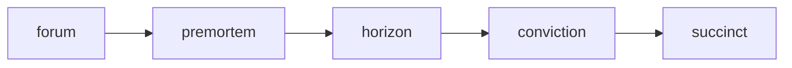
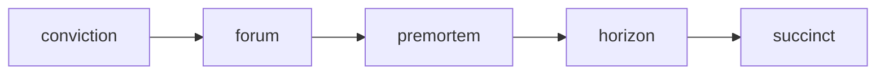

# Thinking Stack

You're making decisions faster than you can think. Operating on vibes, pattern-matching from past experience, and hoping the gaps don't matter. Then something blindsides you — a risk you didn't model, a consequence you didn't trace, an assumption you never questioned.

**thinking-stack** is for founders, product managers, tech leads, strategists, and operators making high-stakes decisions under uncertainty.

This is not a prompt collection. It's a schema-driven reasoning system — each command produces a structured artifact you can act on, share, and revisit. Not conversation. Deliverables.

---

Modern work moves fast, but thinking should not become shallow. **thinking-stack** slows down the right parts: assumptions, incentives, second-order effects, and tradeoffs. Lightweight cognitive infrastructure for making better decisions — deliberate, rigorous, and communicable.

---

## The Five Commands

Each command targets a distinct reasoning capability. Together they cover the full arc from belief to action.

| Command | Reasoning Role | Description |
|---------|---------------|-------------|
| [`/forum`](./forum/README.md) | Expand perspective | Multi-agent council debate that pressure-tests an idea through structured rounds |
| [`/premortem`](./premortem/README.md) | Stress-test the decision | Assume the idea has already failed, work backward to find out why |
| [`/horizon`](./horizon/README.md) | Model consequences | Trace causal chains forward across time bands to surface incentive shifts and scaling failures |
| [`/conviction`](./conviction/README.md) | Clarify what you believe | Map assumptions, weigh evidence, score confidence, and design the cheapest falsifying test |
| [`/succinct`](./succinct/README.md) | Communicate with precision | Compress a messy idea into one executive-ready artifact |

---

## What You Get

Each command produces a structured deliverable, not open-ended conversation.

| Command | Deliverable |
|---------|-------------|
| `/forum` | Recommendation with consensus signal, dissenting positions, and concrete next steps |
| `/premortem` | 10–14 failure causes with mechanisms, early warning signals, and cheap tests to run now |
| `/horizon` | Causal chain map across 3 time bands with incentive shifts, scaling effects, and guardrails |
| `/conviction` | Confidence score, assumption map, evidence inventory, and falsification tests at two time horizons |
| `/succinct` | One-slide artifact: thesis, three pillars, one tradeoff, one metric, one decision ask |

---

## Example: `/premortem`

```
/premortem Launch an API marketplace where partners build and sell integrations to our enterprise customers
```

Representative output (abbreviated):

```markdown
## Premortem: API Marketplace Launch

**Framing Statement**
*It is 18 months later. The API marketplace has failed. Here's what went wrong.*

### Failure Headline
"Enterprise integration marketplace shutters after 14 months — zero partners reached $10K MRR."

### Top Failure Causes

| # | Cause                        | Category  | Mechanism                                          | Likelihood |
|---|------------------------------|-----------|-----------------------------------------------------|------------|
| 1 | No partner economic incentive | Market    | Revenue share too thin to justify partner dev costs  | High       |
| 2 | Enterprise procurement blocks | Execution | Customers can't purchase partner integrations...     | High       |
| 3 | API surface instability       | Technical | Breaking changes in core API erode partner trust...  | Medium     |

### Early Warning Signals (4–12 Weeks)
- Partner pipeline stalls after LOI: >60% of signed partners miss first milestone
- Support tickets from partner devs exceed internal dev tickets 3:1
- Zero enterprise customers install a partner integration in first 8 weeks

### If This Fails, It's Probably Because…
*"If this fails, it's probably because the revenue share doesn't cover partner
acquisition costs, so no serious developer invests in building on the platform."*
```

## Example: `/horizon`

```
/horizon If we successfully drive AI adoption across product and engineering, what happens next?
```

Representative output (abbreviated):

```markdown
## Horizon Analysis: Org-Wide AI Adoption in Product & Engineering

### System Change
Product and engineering teams shift from occasional AI experimentation to
systematic AI-assisted development as the default workflow.

### First-Order Effects (0–3 months)
**Intended:**
- Faster drafts, tests, and boilerplate — PR throughput rises 30–50%
- Reduced time-to-first-commit for new hires

**Unintended:**
- Prompt skill becomes informal power — early adopters gain outsized influence
- Teams generate more code than they can review at current staffing

### Second-Order Effects (3–12 months)
**From faster PR throughput:**
- Code review norms break down — reviewers rubber-stamp AI-generated PRs
  they don't fully understand
- Architecture drift as AI suggestions favor local optima over system coherence

**From prompt skill as informal power:**
- Team velocity becomes unevenly distributed; "AI-fluent" ICs ship 3x
  while others stall, creating morale and leveling tension

### Incentive Shifts
**New power centers:**
- Platform/infra teams that control AI tooling access and prompt libraries
  become organizational gatekeepers

### What Breaks At Scale
- **Quality governance** — current review processes assume human-authored code
  at human speed; AI-assisted volume overwhelms them
- **Security review** — AI-generated code introduces subtle vulnerability
  patterns that existing SAST tools don't catch
- **Performance evaluation** — managers can't distinguish "good engineer
  using AI well" from "AI doing the work"

### Guardrails

| Guardrail               | Risk Addressed          | Metric / Signal                    | Cadence   |
|--------------------------|-------------------------|------------------------------------|-----------|
| "Definition of Done" update | Review quality erosion  | % of PRs with substantive review comments | Monthly   |
| AI-assisted PR rubric    | Rubber-stamp reviews    | Reviewer comprehension spot-checks | Quarterly |
| No-AI drills             | Skill atrophy           | Solo implementation exercise scores | Quarterly |
```

---

## When to Use Which

| Question you're asking | Command |
|------------------------|---------|
| Is this a good idea? | `/forum` |
| What could go wrong? | `/premortem` |
| What does this set in motion? | `/horizon` |
| How much should I trust what I think I know? | `/conviction` |
| How do I make this land? | `/succinct` |

---

## How They Compose

The commands work standalone, but they chain naturally into two full arcs depending on where you start.

**Starting from a question** — you don't yet have a thesis:



Expand perspectives first, stress-test the leading option, model consequences, then ground your belief before compressing.

**Starting from a position** — you already have a belief to examine:



Audit the belief first so the debate is targeted, then run the same pressure sequence.

You don't need all five every time. Common sub-chains:

- **forum → premortem** — debate an idea, then assume the winner fails
- **premortem → horizon** — stress-test a decision, then trace long-range consequences
- **horizon → succinct** — map consequences, then compress for stakeholders
- **conviction → forum** — audit a belief, then open it to multi-perspective debate

---

## Installation

### Prerequisites

- [Claude Code](https://claude.ai/code) installed and configured
- `/forum` requires agent teams, which are experimental and disabled by default — see the [Claude Code agent teams documentation](https://code.claude.com/docs/en/agent-teams) to enable them
- All other commands are single-agent and work out of the box

### Install

```bash
git clone https://github.com/nicoladevera/thinking-stack.git
cd thinking-stack

# Install all commands
./install.sh

# Install a specific command
./install.sh forum
```

Or copy manually:

```bash
cp forum/commands/forum.md ~/.claude/commands/forum.md
```

Commands are available immediately — no restart required. Invoke them in Claude Code with `/command-name`.

---

## Adding Your Own

Each command follows the same structure:

```
command-name/
├── README.md
└── commands/
    └── command-name.md
```

The `.md` file supports Claude Code frontmatter (`description`, `argument-hint`, `allowed-tools`) and full markdown prompt content. See any existing command for the pattern.
